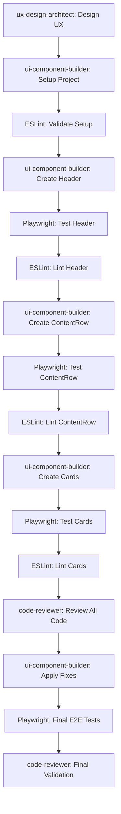

# Netflix-Style AI News Aggregator Frontend Implementation

## Objective
Implement a production-ready Netflix-style frontend for the AI news aggregator using Next.js 14+, TypeScript, Tailwind CSS, Origin UI components, MVP Blocks patterns, and custom components as needed. The interface should feature horizontal scrolling content rows, modal-based article viewing, and a monochrome design system.

## Subagent Execution Strategy

This PRP should be executed using multiple specialized agents for optimal results:

### Primary Agents:
1. **ux-design-architect**: Begin with this agent to design the overall user experience and information architecture
2. **ui-component-builder**: Main implementation agent for creating the UI components and layouts
3. **code-reviewer**: Review all code after implementation for quality and best practices

### Supporting Agents:
- **general-purpose**: For research and gathering documentation
- **backend-api-architect**: If API integration issues arise

### Agent Workflow:
```
1. ux-design-architect → Design user flows and wireframes
2. ui-component-builder → Implement components and layouts
3. code-reviewer → Review implementation
4. ui-component-builder → Apply review feedback
5. code-reviewer → Final validation
```

## Context & Background

### Existing Resources
- **Mock Implementations**: Review `/qwen-mock/hybrid.html` for the tested design patterns
- **V0 Project**: Existing Next.js setup in `/V0-ai-news-aggregator/` with shadcn/ui components
- **Backend API**: Running at `http://localhost:8000` with documented endpoints
- **Design Specification**: Complete spec in `/spec/frontend.md`

### Key Learnings from Prototypes
1. **Monochrome palette**: Black (#000000), grays (#1a1a1a, #333333, #666666), white (#ffffff)
2. **Card dimensions**: 320px width (w-80) for optimal content display
3. **Header style**: Borderless with gradient fade to transparent
4. **Filters**: Positioned below hero section, not in header
5. **Modals**: Click to open, × or outside click to close
6. **Scroll arrows**: Appear only on container hover

## Component Library Strategy

### Priority Order for Component Selection:
1. **Origin UI** (https://originui.com) - Primary component library
   - Use for: Cards, modals, navigation, buttons, forms
   - Benefits: Beautiful, accessible, production-ready components
   
2. **MVP Blocks** (https://mvpblocks.com) - Secondary component library  
   - Use for: Hero sections, feature blocks, pricing tables
   - Benefits: Complete page sections and patterns

3. **Custom Components** - When specific needs aren't met
   - Use shadcn/ui as foundation
   - Apply Tailwind CSS for styling
   - Ensure consistency with monochrome design system

### Component Research Commands:
```bash
# Research Origin UI components
WebSearch("Origin UI horizontal scroll carousel component")
WebSearch("Origin UI modal dialog component monochrome")
WebSearch("Origin UI card component examples")

# Research MVP Blocks patterns
WebSearch("MVP Blocks hero section dark theme")
WebSearch("MVP Blocks content grid layouts")

# Get component library docs via Context7
mcp__context7__resolve-library-id("shadcn-ui")
mcp__context7__get-library-docs("/shadcn-ui/ui", topic="components")
```

## Pre-Implementation Research

### 1. Library Documentation (Use Context7 MCP)
```bash
# Get latest Next.js App Router patterns
mcp__context7__resolve-library-id("nextjs")
mcp__context7__get-library-docs("/vercel/next.js", topic="app-router")

# Get Framer Motion animation examples
mcp__context7__resolve-library-id("framer-motion") 
mcp__context7__get-library-docs("/framer/motion", topic="animations")

# Get Tailwind CSS utilities
mcp__context7__resolve-library-id("tailwindcss")
mcp__context7__get-library-docs("/tailwindlabs/tailwindcss", topic="utilities")

# Get SWR data fetching patterns
mcp__context7__resolve-library-id("swr")
mcp__context7__get-library-docs("/vercel/swr", topic="data-fetching")
```

### 2. Review Existing Code
- Check `/qwen-mock/hybrid.html` for working HTML/CSS patterns
- Review `/V0-ai-news-aggregator/` for existing Next.js setup
- Examine `/src/api/routes.py` for available API endpoints

### 3. API Endpoints Available
```typescript
// Available endpoints from backend
GET  /api/health                   // Health check
GET  /api/articles                  // List articles with filters
GET  /api/articles/{id}            // Get single article
GET  /api/digest/latest           // Get latest digest with audio
GET  /api/stats                   // Article statistics
POST /api/articles/{id}/analyze   // Analyze article
```

## Implementation Blueprint

### Phase 1: Project Setup & Core Layout

#### 1.1 Initialize Next.js Project
```bash
# Create new Next.js project with TypeScript and Tailwind
npx create-next-app@latest ai-news-frontend \
  --typescript \
  --tailwind \
  --app \
  --src-dir \
  --no-import-alias \
  --eslint

cd ai-news-frontend

# Install required dependencies
npm install framer-motion swr axios lucide-react class-variance-authority clsx tailwind-merge
npm install -D @types/node eslint-config-prettier prettier

# Setup ESLint configuration
npx eslint --init

# Install Origin UI components (copy from originui.com)
# Install shadcn/ui CLI for custom components
npx shadcn-ui@latest init
```

#### 1.2 Design System Configuration
Create `src/styles/design-tokens.ts`:
```typescript
export const colors = {
  black: '#000000',
  gray: {
    900: '#1a1a1a',
    800: '#333333',
    700: '#4d4d4d',
    600: '#666666',
    500: '#808080',
    400: '#999999',
    300: '#b3b3b3',
    200: '#cccccc',
    100: '#e6e6e6',
  },
  white: '#ffffff',
}

export const spacing = {
  card: {
    width: '320px', // w-80
    padding: '20px', // p-5
  },
  modal: {
    maxWidth: '1024px', // max-w-4xl
    padding: '32px', // p-8
  },
}
```

#### 1.3 Main Layout Structure
Create `src/app/layout.tsx`:
```typescript
export default function RootLayout({
  children,
}: {
  children: React.ReactNode
}) {
  return (
    <html lang="en">
      <body className="min-h-screen bg-black text-white">
        <Header />
        {children}
        <AudioPlayer />
      </body>
    </html>
  )
}
```

### Phase 2: Core Components with Origin UI

#### 2.1 Netflix Header Component (Origin UI Navigation)
```typescript
// src/components/Header.tsx
// Use Origin UI navigation component with modifications
// Reference: https://originui.com/components/navigation

const Header = () => {
  // First check Origin UI for navigation bar component
  // If not available, use MVP Blocks header pattern
  // Fallback to custom implementation
  
  return (
    <header className="sticky top-0 z-40 bg-gradient-to-b from-black via-black to-transparent">
      <div className="max-w-7xl mx-auto px-6 py-4">
        <div className="flex items-center justify-between">
          <div className="flex items-center space-x-8">
            <h1 className="text-3xl font-bold">AI News Aggregator</h1>
            {/* Use Origin UI Navigation component here */}
            <Navigation />
          </div>
          {/* Use Origin UI SearchBar component */}
          <SearchBar />
        </div>
      </div>
    </header>
  )
}
```

#### 2.2 Horizontal Scrolling Row (Origin UI Carousel)
```typescript
// src/components/ContentRow.tsx
// Use Origin UI carousel/scroll component
// Reference: https://originui.com/components/carousel

interface ContentRowProps {
  title: string
  articles: Article[]
  source: string
}

const ContentRow = ({ title, articles, source }: ContentRowProps) => {
  // First attempt: Use Origin UI horizontal scroll/carousel
  // Second attempt: Use MVP Blocks content grid
  // Fallback: Custom implementation with shadcn/ui ScrollArea
  
  return (
    <div className="mb-12 relative scroll-container group">
      <h2 className="text-2xl font-bold text-white mb-6">{title}</h2>
      <div className="relative">
        {/* Origin UI Carousel component here */}
        <div className="flex space-x-6 overflow-x-auto scrollbar-hide pb-6">
          {articles.map(article => (
            <ArticleCard key={article.id} article={article} />
          ))}
        </div>
        <ScrollArrows containerId={`${source}-container`} />
      </div>
    </div>
  )
}
```

#### 2.3 Article Card (Origin UI Card Component)
```typescript
// src/components/ArticleCard.tsx
// Use Origin UI card component as base
// Reference: https://originui.com/components/card

const ArticleCard = ({ article }: { article: Article }) => {
  // Use Origin UI Card component with custom styling
  // Apply monochrome theme overrides
  
  return (
    <motion.div
      className="flex-shrink-0 w-80 bg-gray-900 rounded-lg overflow-hidden cursor-pointer border border-gray-800"
      whileHover={{ scale: 1.05 }}
      transition={{ duration: 0.3 }}
      onClick={() => openModal(article)}
    >
      {/* Origin UI Card content structure */}
      <div className="h-48 bg-gradient-to-br from-gray-700 to-gray-800 flex items-center justify-center">
        <span className="text-white font-bold text-2xl">
          {getSourceIcon(article.source)}
        </span>
      </div>
      <div className="p-5">
        <h3 className="font-semibold text-white mb-3 line-clamp-2 text-lg">
          {article.title}
        </h3>
        <div className="flex items-center justify-between mb-3 text-sm text-gray-400">
          <span>{formatTimeAgo(article.published_at)}</span>
          <span className="bg-gray-800 px-2 py-1 rounded font-medium">
            {article.relevance_score}%
          </span>
        </div>
        {/* Origin UI Badge components for categories */}
        <div className="flex flex-wrap gap-2 mb-3">
          {article.categories.slice(0, 2).map(cat => (
            <span key={cat} className="text-xs bg-gray-800 text-gray-300 px-3 py-1 rounded-full">
              {cat}
            </span>
          ))}
        </div>
        <p className="text-gray-300 text-sm line-clamp-3">
          {article.summary}
        </p>
      </div>
    </motion.div>
  )
}
```

#### 2.4 Article Modal (Origin UI Dialog)
```typescript
// src/components/ArticleModal.tsx
// Use Origin UI dialog/modal component
// Reference: https://originui.com/components/dialog

const ArticleModal = ({ article, onClose }: ModalProps) => {
  // Use Origin UI Dialog component
  // Customize for full-screen article display
  
  return (
    <AnimatePresence>
      {article && (
        // Origin UI Dialog wrapper with custom animations
        <motion.div
          className="fixed inset-0 bg-black bg-opacity-80 flex items-center justify-center z-50 p-6"
          initial={{ opacity: 0 }}
          animate={{ opacity: 1 }}
          exit={{ opacity: 0 }}
          onClick={onClose}
        >
          {/* Origin UI Dialog content */}
          <motion.div
            className="bg-gray-900 rounded-xl max-w-4xl w-full max-h-[90vh] overflow-y-auto"
            initial={{ scale: 0.9 }}
            animate={{ scale: 1 }}
            onClick={(e) => e.stopPropagation()}
          >
            {/* Modal content using Origin UI components */}
          </motion.div>
        </motion.div>
      )}
    </AnimatePresence>
  )
}
```

### Phase 3: Data Fetching & State Management

#### 3.1 API Client Setup
```typescript
// src/lib/api.ts
import axios from 'axios'
import { Article, Digest } from '@/types'

const API_BASE = process.env.NEXT_PUBLIC_API_URL || 'http://localhost:8000/api'

export const api = {
  articles: {
    list: async (params?: ArticleParams): Promise<Article[]> => {
      const { data } = await axios.get(`${API_BASE}/articles`, { params })
      return data.articles
    },
    get: async (id: string): Promise<Article> => {
      const { data } = await axios.get(`${API_BASE}/articles/${id}`)
      return data
    },
  },
  digest: {
    latest: async (): Promise<Digest> => {
      const { data } = await axios.get(`${API_BASE}/digest/latest`)
      return data
    },
  },
  stats: async () => {
    const { data } = await axios.get(`${API_BASE}/stats`)
    return data
  },
}
```

#### 3.2 SWR Data Hooks
```typescript
// src/hooks/useArticles.ts
import useSWR from 'swr'
import { api } from '@/lib/api'

export function useArticles(source?: string, filters?: ArticleFilters) {
  const key = source 
    ? ['articles', source, filters] 
    : ['articles', filters]
    
  return useSWR(key, () => 
    api.articles.list({ 
      source, 
      ...filters 
    })
  )
}

export function useDigest() {
  return useSWR('digest', api.digest.latest)
}
```

### Phase 4: Advanced Features

#### 4.1 Hero Section (MVP Blocks Hero)
```typescript
// src/components/HeroSection.tsx
// Use MVP Blocks hero section pattern
// Reference: https://mvpblocks.com/hero-sections

const HeroSection = () => {
  const { data: digest } = useDigest()
  const [isPlaying, setIsPlaying] = useState(false)
  
  // First attempt: Use MVP Blocks hero section
  // Fallback: Custom implementation
  
  return (
    <div className="px-6 pt-8 pb-6">
      <div className="max-w-7xl mx-auto">
        {/* MVP Blocks Hero Section with modifications */}
        <div className="bg-gradient-to-r from-gray-900 to-gray-800 rounded-xl p-8">
          <h2 className="text-4xl font-bold mb-4">Today's AI Highlights</h2>
          <p className="text-xl text-gray-300 mb-6">
            {digest?.summary}
          </p>
          {/* Origin UI Button component for audio controls */}
          <AudioControls 
            audioUrl={digest?.audio_url}
            isPlaying={isPlaying}
            onToggle={() => setIsPlaying(!isPlaying)}
          />
        </div>
      </div>
    </div>
  )
}
```

#### 4.2 Filter Controls
```typescript
// src/components/FilterBar.tsx
const FilterBar = () => {
  const [timeRange, setTimeRange] = useState('24h')
  const [relevance, setRelevance] = useState(0)
  
  return (
    <div className="px-6 py-4 border-b border-gray-800">
      <div className="max-w-7xl mx-auto flex items-center justify-between">
        <div className="flex items-center space-x-6">
          <TimeRangeSelect value={timeRange} onChange={setTimeRange} />
          <RelevanceSlider value={relevance} onChange={setRelevance} />
        </div>
        <LastUpdated />
      </div>
    </div>
  )
}
```

## Continuous Testing Strategy

### Real-time Code Validation with ESLint
```bash
# Run ESLint after each component creation
npx eslint src/components/Header.tsx --fix
npx eslint src/components/ContentRow.tsx --fix
npx eslint src/components/ArticleCard.tsx --fix

# Run ESLint on entire project periodically
npm run lint

# Check TypeScript types
npm run type-check
```

### Visual Testing with Playwright MCP (Continuous)
```javascript
// IMPORTANT: Run these tests after implementing each component

// Test 1: After Header implementation
mcp__playwright__browser_navigate("http://localhost:3000")
mcp__playwright__browser_snapshot()  // Verify header structure
mcp__playwright__browser_take_screenshot(filename: "header-implemented.png")

// Test 2: After ContentRow implementation
mcp__playwright__browser_navigate("http://localhost:3000")
mcp__playwright__browser_snapshot()  // Check for content rows
mcp__playwright__browser_take_screenshot(fullPage: true, filename: "content-rows.png")

// Test 3: Test card hover effects
mcp__playwright__browser_hover(element: "Article card", ref: "article-card-1")
mcp__playwright__browser_take_screenshot(filename: "card-hover.png")

// Test 4: Test modal functionality
mcp__playwright__browser_click(element: "Article card", ref: "article-card-1")
mcp__playwright__browser_snapshot()  // Verify modal structure
mcp__playwright__browser_take_screenshot(filename: "modal-open.png")

// Test 5: Test horizontal scrolling
mcp__playwright__browser_click(element: "Scroll right arrow", ref: "scroll-arrow-right")
mcp__playwright__browser_take_screenshot(filename: "scrolled-content.png")

// Test 6: Test responsive design
mcp__playwright__browser_resize(width: 375, height: 667)  // iPhone size
mcp__playwright__browser_take_screenshot(filename: "mobile-view.png")

// Test 7: Test filter interactions
mcp__playwright__browser_click(element: "Time range dropdown", ref: "time-filter")
mcp__playwright__browser_select_option(element: "Time range", ref: "time-filter", values: ["1w"])
mcp__playwright__browser_take_screenshot(filename: "filter-applied.png")

// Test 8: Accessibility check
mcp__playwright__browser_evaluate(function: "() => document.body.getAttribute('aria-label')")
```

### E2E Test Suite
```typescript
// tests/e2e/netflix-ui.spec.ts
describe('Netflix-style UI', () => {
  it('should display horizontal scrolling rows', async () => {
    // Navigate to page
    await page.goto('http://localhost:3000')
    
    // Check for content rows
    const rows = await page.$$('[data-testid="content-row"]')
    expect(rows.length).toBeGreaterThan(0)
    
    // Test horizontal scrolling
    const scrollContainer = await page.$('[data-testid="scroll-container"]')
    await scrollContainer.evaluate(el => el.scrollLeft = 400)
    
    // Verify scroll position changed
    const scrollLeft = await scrollContainer.evaluate(el => el.scrollLeft)
    expect(scrollLeft).toBe(400)
  })
  
  it('should open modal on card click', async () => {
    await page.click('[data-testid="article-card"]')
    const modal = await page.$('[data-testid="article-modal"]')
    expect(modal).toBeTruthy()
    
    // Close modal
    await page.click('[data-testid="modal-close"]')
    const modalClosed = await page.$('[data-testid="article-modal"]')
    expect(modalClosed).toBeFalsy()
  })
})
```

## Validation Gates (Run After Each Phase)

### Phase 1 Validation (After Setup)
```bash
# ESLint check
npx eslint . --ext .ts,.tsx

# TypeScript check  
npx tsc --noEmit

# Verify project structure
ls -la src/
```

### Phase 2 Validation (After Components)
```bash
# Component-specific linting
npx eslint src/components --fix

# Type checking
npm run type-check

# Test component rendering with Playwright
# Use mcp__playwright commands above
```

### Phase 3 Validation (After Data Integration)
```bash
# API integration tests
npm test src/lib/api.test.ts

# Hook tests
npm test src/hooks
```

### Phase 4 Validation (Final)
```bash
# Full test suite
npm run lint
npm run type-check
npm test
npm run build

# E2E tests with Playwright
npm run test:e2e

# Performance check
npm run lighthouse

# Bundle size check
npm run analyze
```

## Performance Optimization

### 1. Code Splitting
```typescript
// Dynamic imports for heavy components
const ArticleModal = dynamic(() => import('@/components/ArticleModal'), {
  loading: () => <ModalSkeleton />,
})
```

### 2. Image Optimization
```typescript
// Use Next.js Image component
import Image from 'next/image'

<Image
  src={article.thumbnail}
  alt={article.title}
  width={320}
  height={180}
  loading="lazy"
  placeholder="blur"
/>
```

### 3. Virtual Scrolling (for large lists)
```typescript
// Use react-window for virtualization
import { FixedSizeList } from 'react-window'

<FixedSizeList
  height={400}
  itemCount={articles.length}
  itemSize={320}
  layout="horizontal"
>
  {({ index, style }) => (
    <div style={style}>
      <ArticleCard article={articles[index]} />
    </div>
  )}
</FixedSizeList>
```

## Error Handling & Edge Cases

### 1. API Error Handling
```typescript
const { data, error, isLoading } = useSWR(
  'articles',
  fetcher,
  {
    onError: (err) => {
      console.error('Failed to fetch articles:', err)
      toast.error('Failed to load articles. Please try again.')
    },
    fallbackData: [],
  }
)
```

### 2. Empty States
```typescript
if (!articles.length) {
  return (
    <div className="text-center py-12">
      <p className="text-gray-400 text-lg">No articles found</p>
      <button onClick={refetch} className="mt-4 px-4 py-2 bg-white text-black rounded">
        Retry
      </button>
    </div>
  )
}
```

### 3. Loading States
```typescript
if (isLoading) {
  return <ContentRowSkeleton />
}
```

## Deployment Checklist

- [ ] Environment variables configured (API_URL)
- [ ] Build optimizations enabled
- [ ] Error tracking setup (Sentry)
- [ ] Analytics integrated
- [ ] SEO meta tags added
- [ ] PWA manifest configured
- [ ] Performance monitoring enabled
- [ ] CDN configured for static assets

## MCP Tool Usage Summary

### Required MCP Tools for Implementation:

1. **Context7 MCP** - Component Library Research
   - Research Origin UI components before implementation
   - Get MVP Blocks patterns documentation
   - Fetch shadcn/ui component examples as fallback
   - Get latest Next.js, Framer Motion docs

2. **Playwright MCP** - Continuous Visual Testing
   - Test after EVERY component implementation
   - Validate hover states and animations
   - Check responsive design at multiple breakpoints
   - Verify accessibility attributes

3. **ESLint via Shell** - Code Quality
   - Run after each file creation/modification
   - Fix linting issues immediately
   - Ensure consistent code style

## Implementation Workflow with Testing



## Success Metrics

- [ ] 60fps animations on all interactions
- [ ] < 3s initial page load
- [ ] 100% keyboard navigable
- [ ] WCAG 2.1 AA compliant
- [ ] Works on all modern browsers
- [ ] Responsive from 320px to 4K displays

## References

- Existing mock: `/qwen-mock/hybrid.html`
- V0 project: `/V0-ai-news-aggregator/`
- Backend API: `http://localhost:8000/docs`
- Design spec: `/spec/frontend.md`
- UI examples: Review Netflix.com for interaction patterns

## Component Priority Reference

### Origin UI Components to Use:
- Navigation Bar
- Cards (Article cards)
- Modal/Dialog (Article details)
- Carousel (Horizontal scrolling)
- Buttons (CTAs and controls)
- Search Input
- Badges (Category tags)
- Slider (Relevance filter)

### MVP Blocks Sections to Use:
- Hero Section (Daily digest area)
- Content Grid (Fallback for rows)
- Feature Blocks (Stats display)

### Custom Components Only:
- Scroll arrows (Netflix-specific)
- Audio player controls
- Custom animations/transitions

## Critical Implementation Notes

1. **Always test with Playwright after each component** - Don't wait until the end
2. **Run ESLint after every file save** - Catch issues immediately
3. **Use Origin UI first** - Only create custom if not available
4. **Follow monochrome palette strictly** - No colors except black/white/gray
5. **Test responsive at 3 breakpoints minimum** - Mobile (375px), Tablet (768px), Desktop (1920px)

## Confidence Score: 8.5/10

The PRP is comprehensive with clear component library priorities and continuous testing strategy. The score is slightly reduced from 9/10 due to:
- Dependency on external component libraries (Origin UI, MVP Blocks) that may require adaptation
- Need for iterative testing and validation throughout implementation
- Multiple agent coordination required for optimal results

However, with the specified agent workflow and continuous validation approach, successful implementation is highly achievable.