# 🤖 AI News Aggregator

An intelligent news aggregation system that fetches, analyzes, and curates AI/ML content from multiple sources. Features a complete backend API, MCP server for AI assistant integration, and web frontend.

**Current Status: ✅ Production Ready** - Backend fully operational with 72/72 tests passing. MCP Server and Frontend in development.

## 🏗️ Architecture Overview

```
┌─────────────────┐    ┌──────────────────┐    ┌─────────────────┐
│   Web Frontend  │    │   MCP Server     │    │  Backend API    │
│   (React/Vue)   │◄──►│  (AI Assistant   │◄──►│   (FastAPI)     │
│                 │    │   Integration)   │    │                 │
└─────────────────┘    └──────────────────┘    └─────────────────┘
         │                        │                        │
         │                        │                        │
         └────────────────────────┼────────────────────────┘
                                  ▼
                          ┌─────────────────┐
                          │   Supabase DB   │
                          │   (PostgreSQL   │
                          │   + pgvector)   │
                          └─────────────────┘
```

## 🚀 Components

### 🖥️ Backend API (`backend/`)
- **FastAPI** server with async processing
- **Multi-source fetching** (ArXiv, HackerNews, RSS)
- **AI-powered analysis** using Google Gemini
- **Semantic deduplication** with vector embeddings
- **Daily digest generation** with text-to-speech

### 🔌 MCP Server (`mcp-server/`)
- **Model Context Protocol** server for AI assistants
- **Direct integration** with Claude, Cursor, and other MCP clients
- **Real-time access** to curated news content
- **AI analysis tools** for content insights

### 🌐 Frontend (`frontend/` - Planned)
- **Modern web interface** for content browsing
- **Real-time updates** and notifications
- **Analytics dashboard** and content management
- **Responsive design** for all devices

## 🛠️ Quick Start

### Prerequisites
- Python 3.11+
- Supabase account with pgvector extension
- Google Gemini API key

### 1. Clone and Setup
```bash
git clone <repository-url>
cd ai-news-aggregator-agent

# Create virtual environment
python -m venv venv_linux
source venv_linux/bin/activate  # On Windows: venv_linux\Scripts\activate
```

### 2. Environment Configuration
Create a `.env` file in the root directory:
```env
# Database
SUPABASE_URL=your_supabase_project_url
SUPABASE_ANON_KEY=your_supabase_anon_key

# AI Services
GEMINI_API_KEY=your_google_gemini_api_key
ELEVENLABS_API_KEY=your_elevenlabs_api_key  # Optional for TTS

# Configuration
SIMILARITY_THRESHOLD=0.85
DEBUG=true
LOG_LEVEL=INFO
```

### 3. Backend Setup
```bash
# Install backend dependencies
pip install -r backend/requirements.txt

# Start the backend API server
python -m uvicorn backend.main:app --reload --host 0.0.0.0 --port 8000
```

The API will be available at `http://localhost:8000` with docs at `http://localhost:8000/docs`.

### 4. MCP Server Setup (Optional)
```bash
# Install MCP dependencies (if different from backend)
pip install -r mcp-server/requirements.txt

# Start the MCP server
cd mcp-server
python server.py
```

### 5. MCP Client Configuration
Add to your MCP client configuration (e.g., Claude's `.mcp.json`):
```json
{
  "mcpServers": {
    "ai-news-aggregator": {
      "command": "python",
      "args": ["-m", "mcp-server.server"],
      "cwd": "/path/to/ai-news-aggregator-agent",
      "env": {
        "SUPABASE_URL": "your_supabase_project_url",
        "SUPABASE_ANON_KEY": "your_supabase_anon_key",
        "GEMINI_API_KEY": "your_google_gemini_api_key"
      }
    }
  }
}
```

## 📡 Usage Examples

### Backend API
```bash
# Check system health
curl http://localhost:8000/api/v1/health | jq

# Fetch latest articles
curl -X POST -H "Content-Type: application/json" \
     -d '{"sources": ["arxiv", "hackernews"]}' \
     http://localhost:8000/api/v1/webhook/fetch | jq

# Get articles with filtering
curl "http://localhost:8000/api/v1/articles?limit=10&min_relevance_score=70" | jq

# Get latest daily digest
curl http://localhost:8000/api/v1/digest/latest | jq
```

### MCP Server Tools
Once connected to an MCP client, you can use tools like:

```python
# Get latest ArXiv papers
await get_latest_arxiv_papers(topic="machine learning", limit=5)

# Search across all sources
await search_content(query="GPT-4", sources=["arxiv", "hackernews"])

# Generate daily digest
await generate_daily_digest(date="2024-01-15", digest_style="executive")

# Analyze trends
await analyze_trends(timeframe="week", min_mentions=5)

# Export articles
await export_articles(article_ids=["1", "2", "3"], format="pdf")
```

## 🏃‍♂️ Development Workflow

### Backend Development
```bash
source venv_linux/bin/activate
cd backend

# Run with hot reload
python -m uvicorn main:app --reload --port 8000

# Run tests
pytest ../tests/backend/ -v

# Type checking
mypy .

# Linting
ruff check . --fix
```

### MCP Server Development
```bash
source venv_linux/bin/activate
cd mcp-server

# Run MCP server
python server.py

# Test MCP tools
pytest ../tests/mcp-server/ -v
```

### Frontend Development (Future)
```bash
cd frontend

# Install dependencies
npm install

# Run development server
npm run dev

# Run tests
npm test
```

## 📚 API Documentation

### Backend API Endpoints
All endpoints are prefixed with `/api/v1`:

#### Health & Status
- `GET /health` - System health and database status
- `GET /stats` - Article counts and processing statistics

#### Articles
- `GET /articles` - List articles with filtering
- `GET /articles/{id}` - Get specific article
- `POST /articles/{id}/analyze` - Re-analyze article

#### Content Management
- `POST /webhook/fetch` - Trigger article fetching
- `GET /digest/latest` - Get latest daily digest

**Interactive Documentation**: Visit http://localhost:8000/docs

### MCP Server Tools
See [MCP Server Specification](spec/mcp-server.md) for detailed tool documentation.

## 🧪 Testing

### Run All Tests
```bash
source venv_linux/bin/activate

# Backend tests
pytest tests/backend/ -v

# MCP server tests (when implemented)
pytest tests/mcp-server/ -v

# Integration tests
pytest tests/integration/ -v
```

### Test Coverage
- **Backend**: 72/72 tests passing
- **Unit tests** for models, services, and API endpoints
- **Integration tests** for external APIs
- **End-to-end tests** for complete workflows

## 🔄 Data Processing Pipeline

```mermaid
graph TD
    A[📡 Content Sources] --> B[🔍 Fetchers]
    B --> C[🤖 AI Analysis]
    C --> D[📊 Quality Filter]
    D --> E[🧮 Vector Embeddings]
    E --> F[🔍 Deduplication]
    F --> G[💾 Database Storage]
    G --> H[🌐 API Serving]
    G --> I[🔌 MCP Tools]
    
    H --> J[📱 Frontend]
    I --> K[🤖 AI Assistants]
```



### Processing Steps
1. **Multi-source Fetching** → ArXiv, HackerNews, RSS feeds
2. **AI Analysis** → Google Gemini relevance scoring and categorization
3. **Quality Filtering** → Only content scoring ≥50 relevance
4. **Vector Embeddings** → 384-dimensional semantic representations
5. **Deduplication** → 85% similarity threshold using cosine distance
6. **Storage** → PostgreSQL with pgvector optimization
7. **Serving** → REST API and MCP tools for various clients

## 📊 Current Status

### ✅ Backend (Production Ready)
| Component | Status | Tests |
|-----------|--------|-------|
| Content Fetching | ✅ Complete | 17/17 |
| AI Analysis | ✅ Complete | 12/12 |
| Deduplication | ✅ Complete | 15/15 |
| REST API | ✅ Complete | 16/16 |
| Digest Generation | ✅ Complete | 12/12 |

### 🚧 MCP Server (In Development)
| Component | Status | Progress |
|-----------|--------|----------|
| Server Framework | 🔄 In Progress | 60% |
| Content Tools | 📋 Planned | 0% |
| Analysis Tools | 📋 Planned | 0% |
| Export Tools | 📋 Planned | 0% |

### 📋 Frontend (Planned)
| Component | Status | Progress |
|-----------|--------|----------|
| UI Framework | 📋 Planned | 0% |
| Dashboard | 📋 Planned | 0% |
| Real-time Updates | 📋 Planned | 0% |

## 🔐 Security & Performance

### Security Features
- **API key management** via environment variables
- **Input validation** with Pydantic models
- **Rate limiting** for external APIs
- **SQL injection protection** via SQLAlchemy ORM

### Performance Optimizations
- **Async processing** for concurrent operations
- **Connection pooling** for database and HTTP clients
- **Vector indexing** (HNSW) for fast similarity search
- **Embedding caching** for improved response times
- **Background tasks** for non-blocking operations

## 🛣️ Roadmap

### Phase 1: Core Infrastructure ✅
- [x] Backend API with multi-source fetching
- [x] AI-powered analysis and deduplication
- [x] Vector search and storage
- [x] Comprehensive testing suite

### Phase 2: MCP Integration 🚧
- [ ] MCP server implementation
- [ ] Content retrieval tools
- [ ] Analysis and export tools
- [ ] Client integration testing

### Phase 3: Frontend Development 📋
- [ ] Modern web interface
- [ ] Real-time content updates
- [ ] Analytics dashboard
- [ ] User management system

### Phase 4: Advanced Features 📋
- [ ] Custom AI model integration
- [ ] Multi-language support
- [ ] Advanced filtering and recommendations
- [ ] Enterprise features (SSO, teams)

## 📁 Project Structure

```
ai-news-aggregator-agent/
├── backend/                 # FastAPI backend services
├── mcp-server/             # Model Context Protocol server
├── frontend/               # Web frontend (future)
├── shared/                 # Shared utilities and models
├── tests/                  # Test suites for all components
├── spec/                   # Technical specifications
├── docs/                   # Documentation
└── scripts/               # Utility scripts
```

See [Project Structure](spec/project-structure.md) for detailed organization.

## 📞 Support & Documentation

- **[API Documentation](http://localhost:8000/docs)** - Interactive API docs
- **[MCP Server Spec](spec/mcp-server.md)** - MCP server technical specification
- **[Project Structure](spec/project-structure.md)** - Detailed project organization
- **[Frontend Spec](spec/frontend.md)** - Frontend design and requirements

## 📄 License

This project is licensed under the MIT License - see the [LICENSE](LICENSE) file for details.

## 🤝 Contributing

1. Fork the repository
2. Create a feature branch (`git checkout -b feature/amazing-feature`)
3. Commit your changes (`git commit -m 'Add amazing feature'`)
4. Push to the branch (`git push origin feature/amazing-feature`)
5. Open a Pull Request

---

**Ready for Production**: The backend API is fully operational and ready for deployment. MCP server and frontend development in progress.